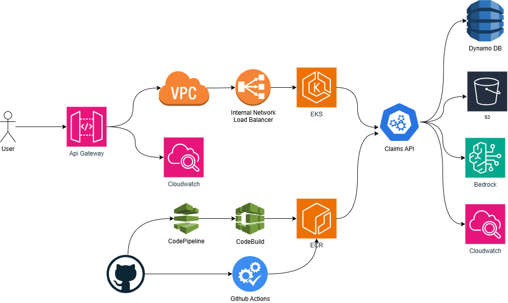

# Architectural Reasoning

## 1) Decision Drivers and Constraints

- Must run Kubernetes workloads on **Amazon EKS with EC2 nodes** (no Fargate abstraction).
- Must expose APIs through **Amazon API Gateway**.
- Must persist claim status in **DynamoDB** and claim notes in **S3**.
- Must integrate GenAI summarization using **Amazon Bedrock**.
- Must provide evidence for CI/CD, security scanning, and observability.
- Must keep implementation reproducible with infrastructure as code.

## 2) High-Level Architecture and Why

## Architecture Diagram

Request flow:

1. Client calls API Gateway HTTP API.
2. API Gateway uses VPC Link to an internal NLB.
3. NLB forwards traffic to EKS backend service (NodePort).
4. Backend service reads/writes claim data in DynamoDB and notes in S3.
5. Summarize endpoint invokes Bedrock Runtime and persists generated summary to the claim record.

Reasoning:

- API Gateway provides a managed external edge with logs/metrics, while EKS keeps workload-level control.
- Private integration through VPC Link + internal NLB avoids exposing Kubernetes service directly.
- DynamoDB is a low-latency operational store for claim state and summary updates.
- S3 is cost-effective and simple for note blob storage and retrieval.

## 3) Key Decisions and Trade-Offs

### Decision A: EKS (EC2) instead of serverless container options

- Chosen because lab constraints require EKS on EC2 and operational Kubernetes ownership.
- Pros: fine-grained control over node sizing, add-ons, and pod-level deployment behavior.
- Cons: more operational overhead than fully managed runtime models.
- Mitigation: Terraform-managed baseline, managed node groups, and explicit rollout commands.

### Decision B: API Gateway HTTP API + VPC Link + internal NLB

- Chosen to keep external API managed while backend remains private in VPC.
- Pros: clear separation of edge and compute, straightforward CloudWatch access logging, TLS termination options at edge.
- Cons: extra hop and extra components (VPC Link, NLB, target mapping).
- Mitigation: automate all resources in Terraform and export API artifacts under `apigw/`.

### Decision C: DynamoDB for claims, S3 for notes

- Claims require key-based reads/updates and summary persistence; DynamoDB fits that pattern.
- Notes are document-style append/update/delete blobs; S3 object storage keeps this simple and inexpensive.
- Trade-off: notes operations require read-modify-write of JSON object rather than item-level DB updates.
- Mitigation: service-layer encapsulation (`NotesService`) and fallback handling.

### Decision D: Bedrock summarization with per-field generation

- Chosen to generate each required field independently: overall, customer-facing, adjuster-focused, next-step.
- Pros: better control of tone/objective for each output field; easier prompt tuning per field.
- Cons: multiple model calls increase latency and token cost compared to single-call generation.
- Mitigation: deterministic fallback summary path and persisted result to avoid repeated generation for same claim state.

### Decision E: CI/CD split between AWS-native and GitHub Actions artifacts

- Repository includes AWS-native definitions (CodePipeline + CodeBuild) and GitHub Actions workflow.
- Rationale: satisfy explicit deliverable for AWS pipeline definitions while preserving fast iteration path already used.
- Trade-off: dual pipeline definitions need alignment over time.
- Mitigation: keep shared container build/deploy logic documented under `pipelines/`.

## 4) Security and Compliance Reasoning

- IRSA is used so pods assume scoped IAM role instead of node-wide credentials.
- Least-privilege policies separate DynamoDB/S3/Bedrock permissions by workload role.
- ECR scanning and Inspector/Security Hub evidence support vulnerability governance.
- API access and workload logs are centralized in CloudWatch for auditability.

## 5) Observability Reasoning

- API Gateway access logs provide route/status/request-level visibility at edge.
- Container Insights adds pod-level CPU/memory/restart metrics for Kubernetes health.
- Logs Insights queries are versioned in repo to make troubleshooting reproducible.
- Dashboard template in `observability/cloudwatch-dashboard.json` standardizes evidence capture.

## 6) Risks, Assumptions, and Mitigations

- Assumption: selected Bedrock model is available in deployment region and account.
  - Mitigation: configurable `BEDROCK_MODEL_ID` and fallback summarization path.
- Risk: model output format drift (free text or malformed JSON-like output).
  - Mitigation: robust response extraction/parsing and field-level fallback behavior.
- Risk: operational complexity in private API integration path.
  - Mitigation: Terraform-managed NLB/VPC Link/API routes and exported OpenAPI/routes artifacts.
- Risk: stale container tag deployment.
  - Mitigation: explicit image tagging and rollout status checks in deploy flow.

## 7) Alternatives Considered

- Single Bedrock call returning all fields in one JSON payload.
  - Rejected because field-specific guidance was less controllable and parsing robustness was weaker for this lab context.
- Storing notes in DynamoDB.
  - Replaced with S3 to align with functional requirement that summarize reads notes from S3.
- Public ALB ingress to EKS.
  - Not selected to keep backend private and emphasize API Gateway as the external API facade.

## 8) Future Improvements

- Add caching strategy for repeated summarize requests on unchanged notes.
- Add contract tests and load tests in CI pipeline stages.
- Add stricter Bedrock IAM scoping from wildcard to exact model ARN(s).
- Add structured application logs for easier query dimensions (claim ID, route, latency).
